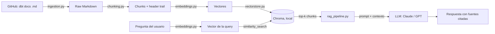

# dbt RAG Assistant

Asistente de preguntas y respuestas sobre la documentación oficial de **dbt**, construido con un pipeline RAG (Retrieval-Augmented Generation) completo, pensado con mentalidad de Data Engineering: ingesta reproducible, procesamiento versionable, evaluación medible.

> Por qué dbt: es una herramienta central en el stack de datos moderno. Este proyecto es, literalmente, un Data Engineer construyendo tooling de IA para la herramienta que usa todos los días — la intersección entre ambos mundos.

## Arquitectura



**Stack y por qué cada pieza:**

| Componente | Elección | Motivo |
|---|---|---|
| Fuente de datos | Docs de dbt vía GitHub API + raw.githubusercontent.com | Datos reales, actualizables, sin scraping fragil |
| Chunking | Custom, consciente de estructura Markdown/headers | Mejor calidad de retrieval que cortar a lo bruto por caracteres |
| Embeddings | Local (`bge-small-en-v1.5`) por defecto, swap a OpenAI/Voyage | Gratis y reproducible; intercambiable sin tocar el resto del código |
| Vector store | Chroma, embebido (persiste a disco local) | Cero fricción: sin servidor, sin Docker, `pip install` y listo. Ver nota abajo. |
| Generación | Claude Haiku o GPT-4o-mini (configurable) | Correr un LLM local competitivo sin GPU no es realista; el costo de la API es marginal |
| Evaluación | RAG triad (context relevance, groundedness, answer relevance) con LLM-as-judge | Mide si el sistema realmente funciona, no solo si "no tira error" |

> **Nota sobre la elección de vector store:** la decisión "natural" viniendo de Data Engineering hubiera sido Postgres + pgvector (reutilizás SQL, se parece más a un stack de producción real). Acá se usa Chroma en su lugar por una razón pragmática y documentada, no por ignorancia de la alternativa: evita la dependencia de Docker para iterar rápido en desarrollo local. Migrar a pgvector más adelante es un cambio acotado a `src/vectorstore.py` — la interfaz (`insert_chunks`, `similarity_search`) es la misma, así que el resto del pipeline no se entera del cambio. Vale la pena mencionar esta decisión explícitamente en una entrevista: mostrar que entendés el trade-off es mejor que fingir que no lo hubo.

## Estructura del repo

```
├── src/
│   ├── config.py         # toda la configuración vía variables de entorno
│   ├── ingestion.py       # baja los docs de dbt desde GitHub
│   ├── chunking.py        # split consciente de estructura Markdown/MDX
│   ├── embeddings.py       # interfaz intercambiable: local / OpenAI / Voyage
│   ├── vectorstore.py      # capa sobre Postgres + pgvector
│   ├── rag_pipeline.py     # retrieval + prompt + llamada al LLM
│   └── evaluate.py         # evaluación con el RAG triad
├── scripts/build_index.py  # job end-to-end de indexado (el "ETL" del proyecto)
├── api/main.py             # API FastAPI (POST /query)
├── app/streamlit_app.py    # UI de chat
├── tests/                  # tests unitarios (no dependen de red ni API keys)
├── docker-compose.yml
└── Dockerfile
```

## Cómo correrlo

Todo corre directo con Python — **no hace falta Docker** para nada de esto (Chroma no necesita servidor).

### 1. Prerequisitos
- Python 3.11+
- Una API key de Anthropic o de OpenAI (para la parte de generación; los embeddings son locales y gratis por defecto)

### 2. Configurar

```bash
cp .env.example .env
# editá .env y completá al menos ANTHROPIC_API_KEY (o OPENAI_API_KEY si preferís ese proveedor)
```

**Nota importante sobre GitHub:** la API de listado de GitHub sin autenticar tiene un límite de 60 requests/hora por IP. El proyecto entero necesita solo 1 request para listar todos los docs, así que normalmente no es problema — pero si lo corrés varias veces seguidas (o desde una IP compartida) te vas a quedar sin cupo. Solución: generá un token sin permisos especiales en [github.com/settings/tokens](https://github.com/settings/tokens) y ponelo en `GITHUB_TOKEN` — sube el límite a 5000/h.

### 3. Instalar dependencias

```bash
python3 -m venv venv
source venv/bin/activate      # Windows: venv\Scripts\activate
pip install -r requirements.txt
```

### 4. Indexar el corpus

```bash
python scripts/build_index.py --limit 50   # empezá con un subset chico para probar rápido
# python scripts/build_index.py --rebuild  # corpus completo, una vez que confirmes que anda
```

Esto crea una carpeta `data/chroma_db/` con el índice ya armado — no se sube a git (está en `.gitignore`) y es autocontenida: si la borrás, `build_index.py` la vuelve a crear.

### 5. Levantar la API y la UI

En dos terminales separadas (dejá cada una corriendo):

```bash
# Terminal 1
uvicorn api.main:app --reload --port 8000

# Terminal 2
streamlit run app/streamlit_app.py
```

- UI de chat: http://localhost:8501
- API: http://localhost:8000/docs (Swagger autogenerado)

### 6. Evaluar la calidad

```bash
python -m src.evaluate
```

Te da un score de 1-5 en context relevance, groundedness y answer relevance sobre un set de preguntas de prueba (personalizable con `--questions archivo.txt`).

## Publicarlo con un link (Streamlit Community Cloud)

1. Subí el proyecto a un repo de GitHub (**no subas tu `.env`** — ya está en `.gitignore`, no hace falta que hagas nada extra).
2. Entrá a [share.streamlit.io](https://share.streamlit.io), conectá tu cuenta de GitHub.
3. "New app" → elegí el repo, branch `main`, archivo principal `app/streamlit_app.py`.
4. En "Advanced settings" → "Secrets", pegá (en formato TOML plano, sin secciones):
   ```
   ANTHROPIC_API_KEY = "sk-ant-..."
   GITHUB_TOKEN = "ghp_..."
   ```
5. Deploy. La primera vez va a tardar unos minutos: instala dependencias y, como el índice arranca vacío en un servidor nuevo, la app se auto-indexa sola (ver `STARTUP_INDEX_LIMIT` en `.env.example` para acotar cuánto corpus indexa en ese primer arranque).

**Nota sobre recursos:** el tier gratuito de Streamlit Cloud tiene 1 GB de RAM. `torch` + `sentence-transformers` (para embeddings locales) pueden ir justos ahí. Si el deploy falla por límite de recursos, la solución es cambiar `EMBEDDING_PROVIDER=openai` (o `voyage`) en los Secrets — el pipeline ya está armado para soportar el cambio sin tocar código, solo hace falta esa API key adicional.

### Opcional: Docker

`docker-compose.yml` sigue en el repo por si más adelante querés containerizar la API y la UI (por ejemplo para desplegarlo en un servidor). No es necesario para desarrollo local.

## Limitaciones conocidas y próximos pasos

Esto es tan importante como el código que funciona — mostrar que entendés los límites del sistema:

- **Sin reranking:** el retrieval actual es solo similitud vectorial. Agregar un cross-encoder como segunda pasada mejoraría precisión, especialmente en preguntas ambiguas.
- **Sin búsqueda híbrida:** un término técnico exacto (ej. un nombre de macro de dbt) a veces lo encuentra mejor BM25 que embeddings semánticos. Combinar ambos (hybrid search) es la mejora más directa de calidad.
- **Indexado manual:** hoy `build_index.py` se corre a mano. El siguiente paso natural es orquestarlo con **Airflow** o **Dagster** con un schedule (ej. semanal), reindexando solo los docs que cambiaron — ahí es donde el perfil de Data Engineer se nota más.
- **Evaluación con un set chico de preguntas:** para un análisis serio, armar un dataset de 30-50 preguntas con respuestas de referencia y correr `ragas` sobre eso.
- **Los docs de dbt están en MDX**, no Markdown puro — ya se limpian imports y componentes auto-cerrados, pero componentes más complejos (tablas dinámicas, tabs) todavía pueden dejar ruido residual en el texto.
